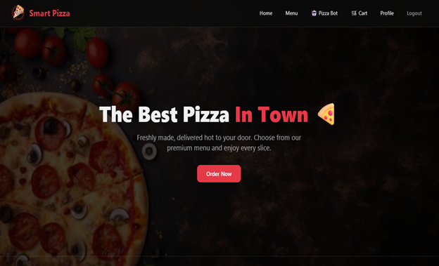
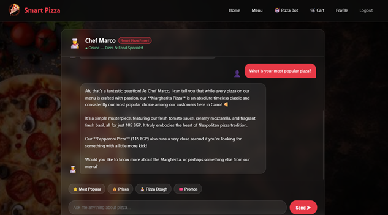

# 🍕 Smart Pizza — Online Pizza Ordering Platform

<p align="center">
  
  
  
  
  
</p>

<p align="center">
  <b>Order your favorite pizza in minutes.</b><br>
  A full-featured Flask web app for browsing the menu, ordering, tracking your order, and chatting
  with an AI pizza expert — built for Smart Pizza, Cairo.
</p>

---

## 📖 About

**Smart Pizza** is a complete online ordering platform for a pizza restaurant, built with **Flask**.
It covers the full customer journey — account creation, browsing the menu, adding items to a cart,
applying promo codes, checking out, and tracking order status — alongside an **admin dashboard**
for managing orders and viewing sales analytics.

The app also features **Chef Marco** 👨‍🍳, an AI-powered chatbot (built on Google Gemini) that acts
as the restaurant's virtual pizza expert — answering questions about the menu, pizza history,
recipes, and helping customers decide what to order, in both English and Arabic.

---

## 🖼️ Screenshots

<p align="center">
  
  <br><i>Home page</i>
</p>

<p align="center">
  
  <br><i>ChatBot</i>
</p>


<p align="center">
  
  <br><i>Admin Dashboard</i>
</p>


---

## ✨ Features

### 🛒 Customer experience
- 🔐 **User accounts** — secure registration and login with `Flask-Login` and hashed passwords.
- 🍕 **Menu browsing** with detailed pizza listings.
- 🛍️ **Shopping cart** — add, increase, decrease, or remove items, with a live cart counter in the nav bar.
- 🏷️ **Promo codes** — apply discount codes at checkout (`PIZZA10`, `WELCOME20`, `SAVE15`).
- 📦 **Order checkout & tracking** — place an order and follow its status (`Preparing`, `On the way`, `Delivered`, `Cancelled`).
- 👤 **Profile management** — update personal details and view past orders.
- 🤖 **Chef Marco AI chatbot** — an in-app assistant powered by Gemini that recommends pizzas, explains ingredients, shares recipes, and answers order-related questions in English or Arabic.

### 🛠️ Admin experience
- 📊 **Admin dashboard** with key metrics: total revenue, number of users, and average order value.
- 📈 **Order status breakdown** and **daily order volume** (last 7 days).
- 🍕 **Revenue by pizza type**, to see which items sell best.
- ✅ **Order status management** — update any order's status directly from the dashboard.

---

## 🛠️ Tech Stack

| Category | Technology |
|---|---|
| Backend | Python, Flask |
| Database / ORM | SQLite, Flask-SQLAlchemy |
| Authentication | Flask-Login, Werkzeug (password hashing) |
| AI Chatbot | Google Gemini (`google-generativeai`) |
| Frontend | HTML, CSS, JavaScript (Jinja2 templates) |

---

## 📂 Project Structure

```
Pizza-restaurant/
├── instance/                # SQLite database (pizza.db)
├── static/                  # CSS / JS / image assets
├── templates/                # HTML pages (Jinja2)
│   ├── index.html
│   ├── menu.html
│   ├── chatbot.html
│   ├── register.html
│   ├── login.html
│   ├── profile.html
│   ├── cart.html
│   ├── order_status.html
│   └── admin.html
├── app.py                   # App entry point, models & all routes
└── requirements.txt
```

---

## 🍕 Menu

| Pizza | Price | Description |
|---|---|---|
| Margherita Pizza | 105 EGP | Tomato sauce, fresh mozzarella, fresh basil |
| Pepperoni Pizza | 115 EGP | Spicy pepperoni, mozzarella, tomato sauce |
| Veggie Supreme | 100 EGP | Mushrooms, olives, bell peppers, onions, tomatoes |
| BBQ Chicken Pizza | 110 EGP | Grilled chicken, smoky BBQ sauce, red onions, cheese |
| Four Cheese Pizza | 100 EGP | Mozzarella, cheddar, parmesan, blue cheese |
| Seafood Pizza | 120 EGP | Shrimp, calamari, garlic cream sauce, mozzarella |

---

## 🚀 Getting Started

### Prerequisites
- Python 3.x
- pip
- A [Google Gemini API key](https://ai.google.dev/) (for the Chef Marco chatbot)

### Installation

```bash
# 1. Clone the repository
git clone https://github.com/Mohamedsayed01/Pizza-restaurant.git
cd Pizza-restaurant

# 2. (Optional but recommended) create a virtual environment
python -m venv venv
source venv/bin/activate   # On Windows: venv\Scripts\activate

# 3. Install dependencies
pip install -r requirements.txt

# 4. Set your environment variables
# Create a .env file, or export them directly:
export SECRET_KEY="your-secret-key"
export GEMINI_API_KEY="your-gemini-api-key"

# 5. Run the app
python app.py
```

Then open your browser at:
```
http://127.0.0.1:5000
```

> ⚠️ On first run, the app automatically creates the database and a default admin account:
> **Email:** `admin@pizza.com` · **Password:** `admin123`
> Make sure to change this password before deploying to production.

> ⚠️ **Security note:** the Gemini API key in `app.py` should be moved to an environment variable (`os.environ.get("GEMINI_API_KEY")`) rather than hardcoded, before pushing this project publicly or deploying it.

---

## 🖥️ Usage

1. Create an account on the **Register** page (or log in as admin).
2. Browse the **Menu** and add pizzas to your cart.
3. Apply a promo code at checkout for a discount.
4. Place your order and track its status on the **Order Status** page.
5. Chat with **Chef Marco** anytime for menu recommendations or pizza tips.
6. Admin users can access `/admin` to view sales analytics and manage order statuses.

---

## 🗺️ Roadmap

- [ ] Move all secrets (API keys, `SECRET_KEY`) to environment variables.
- [ ] Add payment gateway integration.
- [ ] Add order notifications (email/SMS).
- [ ] Deploy the project (Render / Railway / Heroku).

---

## 🤝 Contributing

Contributions are welcome! To contribute:

1. Fork the project
2. Create your feature branch (`git checkout -b feature/AmazingFeature`)
3. Commit your changes (`git commit -m 'Add some AmazingFeature'`)
4. Push to the branch (`git push origin feature/AmazingFeature`)
5. Open a Pull Request

---

## 📄 License

This project is licensed under the **MIT License** — feel free to use and build on it, with attribution.

---

## 👤 Author

**Mohamed Sayed**
🔗 [GitHub](https://github.com/Mohamedsayed01)

---

<p align="center">Made with ❤️ and 🍕 in Cairo, Egypt</p>
